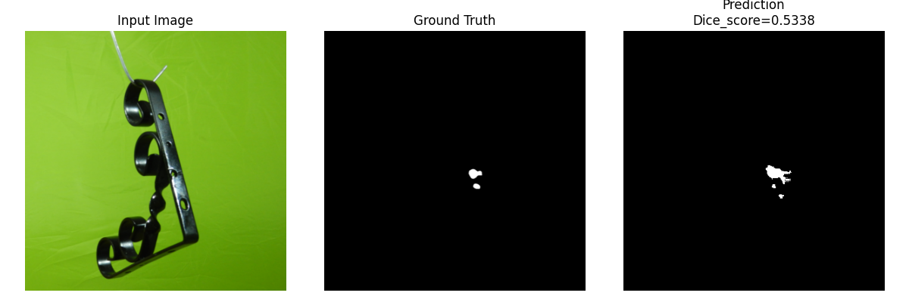

# Computer Vision Project: Defect Detection  

This project implements **defect detection in mechanical components** using a **U-Net segmentation model**.  

It covers:  
- Environment setup with Torch + CUDA support  
- Dataset preprocessing  
- Model training  
- Inference  

---

## Environment Setup  

This project was tested with the following environment:  

- **Python**: 3.12.10  
- **Torch**: 2.2.2  
- **CUDA**: 11.8  
- **Torchvision**: 0.17.2  

### Steps to Set Up  
1. Clone the repository:  
   ```bash
   git clone https://github.com/sanika79/defect_detection.git
   cd defect_detection

2. (Optional) Set Python version with pyenv:
   ```bash
   pyenv local 3.12.10

3. Install dependencies with Poetry:
   ```bash
   poetry install 

4. To add any new package:
   ```bash
   poetry add <package-name>

5. Update paths in config/dev.yaml for raw and processed data. (Paths are kept as generic as possible.)

## Dataset Preprocessing
- Out of the six provided mechanical components, this project focuses on bracket_black.

- Original dataset structure:

   ```bash
   bracket_black/
   │── train/
   │    └── good/
   │── test/
   │    ├── good/
   │    ├── hole/
   │    └── scratches/
   │── ground_truth/
        ├── hole/
        └── scratches/


## Preprocessing Steps
- Defective test images (test/hole and test/scratches) have binary masks in ground_truth/hole and ground_truth/scratches.
- Good images have no defects, so they are paired with an empty black mask.
- The dataset can be used for a Supervised Defect detection problem as we have the defect images and their corresponding mask annotations.
  
- Therefore, images and masks are renamed with a consistent convention:

   ```bash
   000_good.png mapped to 000_good_mask.png
   007_hole.png mapped to 007_hole_mask.png
   010_scratch.png mapped to 010_scratch_mask.png

- Good and defect images are merged and split into train/validation sets using stratified sampling:
- 70% good + 70% defect → train
- 30% good + 30% defect → val

## Final processed dataset structure:

      ```bash
      processed_dataset/
      │── train/
      │    ├── images/
      │    └── masks/
      │── val/
           ├── images/
           └── masks/

## Hence, run the following scripts

 - To create processed train/val splits as above.
   
      ```bash
      python prepare_dataset.py
   
-  To verify the correct image-to-mask matching
  
     ```bash
      python img_mask_matching.py


 ### Training
- Once preprocessing is complete, train the U-Net model:

     ```bash
     python u_net_train.py

- Checkpoints are saved under the lightning_logs/ directory.

## Loss function used while training

- Since the dataset is highly imbalanced, the Soft Dice coefficient and the Soft Dice loss have been used to evaluate the validation performance of the model.
- The episolon value in the Dice loss has come with experimentation.

- Use the saved checkpoints for inference.

## Inference
Specify checkpoint path in config/dev.yaml and call it in inference script.
Run inference with:

      ```bash
      python u_net_infer.py 

- This will generate predictions (defect masks) for the given input images, calculate dice score and accuracy.

## Results  

Below are placeholders for results (to be updated with actual outputs):  

### Training Curves  

- Several tests were conducted to tune the U-net model with the best hyperparameters.
- Model outputs present in outputs/ directory
 

Example:  
  


---

### Quantitative Metrics for a sample image

| Metric        | Value (Test 2)  |  Value (Test 3) |
|---------------|-----------------| --------------- |
| Dice Score    |                 |                 |
| Accuracy      |                 |                 |

---

### Sample Predictions  

  
   

## Conclusions
- The 'Scratch' defect performed really well in Test 3.
- 


## Summary
- Dataset preparation ensures correct mapping of images and masks.

- U-Net is trained with stratified splits of good and defect images.

- Checkpoints are stored for reproducibility.

- Inference can be performed using trained models.
