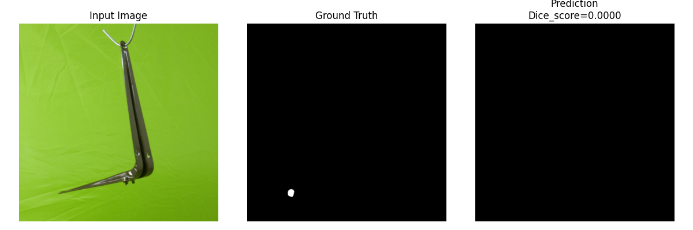

# Computer Vision Project: Defect Detection  

- This project implements a semantic segmentation task where the goal is to identify and segment regions of defects (such as holes or scratches) in images of objects.
- A U-Net model is used to predict a mask highlighting defect areas, distinguishing them from non-defective (good) regions.
- Performance is also tested by training on 1 dataset and testing on a new dataset. (Cross dataset evaluation)
- An Attention U-net model has also been implemented at the end.

It covers:  
- Environment setup with Torch + CUDA support  
- Dataset preprocessing  
- Model training  
- Inference  

---

## Environment Setup  

This project was tested with the following environment:  

- **Python**: 3.12.10
- **Poetry**: 1.8.3
- **Torch**: 2.2.2  
- **CUDA**: 11.8  
- **Torchvision**: 0.17.2  

### Steps to Set Up  
1. Clone the repository:  
   ```bash
   git clone https://github.com/sanika79/defect_detection.git

2. (Optional) Go inside project directory and set Python version with pyenv:
   ```bash
   pyenv local 3.12.10

3. Install poetry inside your current Python environment
   ```bash
   pip install --upgrade pip
   pip install poetry==1.8.3

4. Install dependencies with Poetry:
   ```bash
   poetry install 

5. To add any new package:
   ```bash
   poetry add <package-name>

6. Update paths in config/dev.yaml for raw and processed data. (Paths are kept as generic as possible.)

## Dataset Preprocessing
- Out of the six provided mechanical components, this project focuses on **bracket_black**.

- Original dataset structure:

   ```bash
   bracket_black/
   │── train/
   │    └── good/
   │── test/
   │    ├── good/
   │    ├── hole/
   │    └── scratches/
   │── ground_truth/
        ├── hole/
        └── scratches/


## Preprocessing Steps
- Defective test images (test/hole and test/scratches) have binary masks in ground_truth/hole and ground_truth/scratches.
- Good images have no defects, so they are paired with an empty black mask.
- The dataset can be used for a Supervised Defect detection problem as we have the defect images and their corresponding mask annotations.
  
- Therefore, images and masks are renamed with a consistent convention:

   ```bash
   000_good.png mapped to 000_good_mask.png
   007_hole.png mapped to 007_hole_mask.png
   010_scratch.png mapped to 010_scratch_mask.png

- Good and defect images are merged and split into train/validation sets using stratified sampling:
- 70% good + 70% defect → train
- 30% good + 30% defect → val

## Final processed dataset structure:

      ```bash
      processed_dataset/
      │── train/
      │    ├── images/
      │    └── masks/
      │── val/
           ├── images/
           └── masks/

## Hence, run the following scripts

 - To create processed train/val splits as above.
   
      ```bash
      python prepare_dataset.py
   
-  To verify the correct image-to-mask matching
  
     ```bash
      python img_mask_matching.py


 ### Training
- Once preprocessing is complete, train the U-Net model:

     ```bash
     python u_net_train.py

- Checkpoints are saved under the lightning_logs/ directory.

## Loss function used while training

- Since the dataset is highly imbalanced, the Soft Dice coefficient and the Soft Dice loss have been used to evaluate the validation performance of the model.

## Soft Dice Coefficient & Loss  

- The **Dice Coefficient** is a common evaluation metric for image segmentation.
- It measures the overlap between predicted masks and ground truth masks.  

### Soft Dice Coefficient  
The *soft* version works directly with predicted probabilities instead of hard thresholded masks:  

Soft Dice = (2 * sum(p_i * g_i)) / (sum(p_i) + sum(g_i) + epsilon)

Where:

p_i = predicted probability for pixel i
g_i = ground truth label for pixel i (0 or 1)
epsilon = small constant to avoid division by zero 

### Soft Dice Loss  
The **Soft Dice Loss** is derived from the coefficient and used as the optimization objective:  

Soft Dice Loss} = 1 - Soft Dice

This encourages the model to maximize overlap between predicted and ground truth masks.  

### Why Soft Dice?  
- Works well for **imbalanced datasets** (e.g., small defect areas vs. large background).  
- Provides smoother gradients for training compared to hard Dice or accuracy.
- Hard dice gives unstable training and messy loss curves while training.
- Often combined with **Binary Cross-Entropy (BCE)** for improved stability (BCE has smooth gradients).

### Total loss - Soft Dice loss + BCE loss 

### Training Curves  

- Several tests were conducted to tune the U-net model with the best hyperparameters.
- Model outputs present in outputs/ directory

### Test 1 insights for bracket_black
- The model did not converge well in Test 1. Hence, it was important to increase the number of epochs and patience for early stopping.

  


  
### Improvement in Test 2 and Test 3
  


## Inference
- Specify checkpoint path in config/dev.yaml and call it in inference script.
Run inference with:

   ```bash
   python u_net_infer.py 

- This will generate predictions (defect masks) for the given input images and also calculate dice score and accuracy.


### What is expected?
- The model should detect defect areas in the form of masks and return an empty black image for non-defective images.

- We use the validation set for testing and inference since we do not have a large number of samples in the overall dataset with defects to test our 'defect detection' model.

- Since pixel accuracy can be misleading if the dataset is imbalanced (e.g., 95% background, 5% defects) and the model predicting all background will get ~95% accuracy. We stick to Dice score.

### Mean dice score on validation set

| Metric        | Value (Test 2)  |  Value (Test 3) |
|---------------|-----------------| --------------- |
| Mean Dice Score    |    0.0643       |     0.0763      |


### Defect predictions  (test 2 vs test 3)

- Test 2
 
- Test 3
  

 - Test 2
 
- Test 3
  

 ### Few False positives from Test 2
 


## Observations

- The dice scores for 'Scratch' defect performed improved from Test 2 to Test 3.
- Test 2 (trained on fewer epochs) had more false positives than Test 3.


# Training on different dataset - bracket_brown

- This time the **U-net input resolution was increased to - 512x512** since this dataset had more complicated patterns with multiple defects in same image.

 


- The training curves look very noisy especially for dice loss.
- It is also failing to converege. This suggests that model is not generalizing well to the validation set.

## Bracket brown inference results on validation set
- These patterns were difficult to detect as compared to holes and scratches present in the Bracket Black dataset.
- These had multiple defects in the same image.

- True positives
 

 


- False positive


- False negative

  
### Cross dataset evaluation

Now that we have processed 2 datasets, we run 
Model trained on --> Bracket brown dataset to infer on bracket black validation set which is unseen for the model.


- We observe that model is trying to predict multiple defects in the same image since it has been trained to identify multiple pixel-patches or groups belonging to the same image array.

Model trained on --> Bracket black dataset to infer on Bracket brown validation set which is unseen for the model.


- The model is probably trying to detect features that resemble holes or scratches in the unseen dataset.

### Attention U-net

- I implemented this network because the attention block computes an attention map which helps the model focus on relevant spatial regions during upsampling.
- This is useful because our dataset has images with very few foreground pixels for defects.
- It adds 2 signals - gating signal g comes from the decoder and the other one comes from the skip connections.

     ```bash
     python att_unet_train.py

     ```bash
     python att_unet_infer.py

### Attention U-net results

 


### Mean dice score comparision

| Metric        | U-net  |  Attention U-net |
|---------------|-----------------| --------------- |
| Mean Dice Score    |    0.0763       |     0.0812      |


## Summary
- Dataset preparation ensures correct mapping of images and masks.

- U-Net is trained with stratified splits of good and defect images.

- Checkpoints are stored for reproducibility.

- Inference can be performed using trained models.
